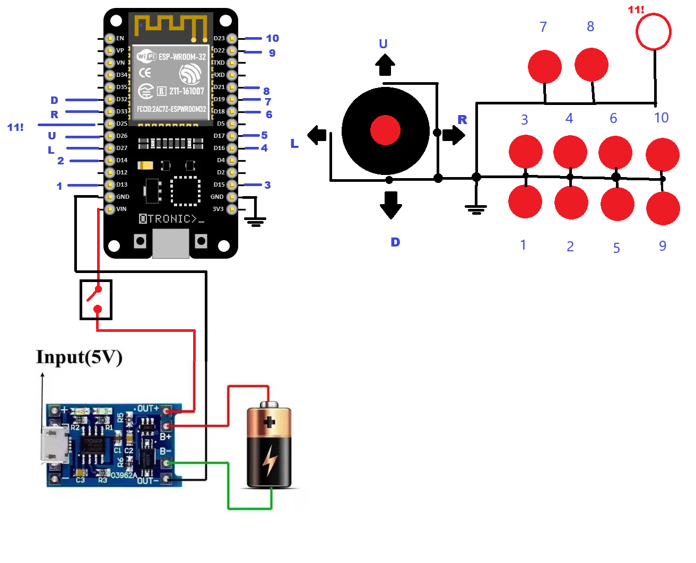

# ESP32-Bluetooth-ArcadeController
ESP-32's project that make an arcade based controller works as bluetooth controller for use with Android, PC and Raspberry

Based on lemmingDev's library named ESP32-BLE-Gamepad, it's and 11 button just to build project.

As shown bellow, just few componets and 'PULLED UP' pins conected on each microswitch, and these straightly to GND.

<b>Features</b>

For default are 11 buttons and 1 hat for directional, but is possible to change from hat to X and Y axis.
Simply while esp32 is turned off press and hold 7 + 8 and turn it on while pressing and hold it for 10 seconds. When you release it will work as X and Y axis until it's turned off.

<b>BOM:</b>

1 x ESP-32 DevKit V1 (you can use any flavour)
1 x ON/OFF switch
1 x 3,7v (mobile phone batteries or 18650)
1 x TP4056 module (as BMS)
1 x Arcade Kit you can easily find in aliexpress

plywood, steel, tools and cabinet is up to you.
use your creative instincs or buy a pre-built cabinet on any markteplace of your preference.

<b>Preparing ESP-32</b>

First step: Arduino-IDE

Download and install from: https://docs.arduino.cc/software/ide/

After intallation go to File >> Preferences
In the field 'Additional boards manager URLs:' paste this url bellow:
https://raw.githubusercontent.com/espressif/arduino-esp32/gh-pages/package_esp32_index.json
(If you already have any other link, at the end of the field write a comma and then put this url)

Second step: ESP32-BLE-Gamepad library

follow ESP32-BLE-Gamepad's page in https://github.com/lemmingDev/ESP32-BLE-Gamepad on 'Installation' section;

Third step: compilling and upload to device

Download and open in Arduino-IDE the file Controller-ESP32.ino found on 'sourcecode' folder of this project.

WIRE EVRYTHING AND ENJOY!!!!

Notes: if you don't need all this number of buttons is just not to wire that you don't want, but i do reccomend you don't miss button 7 and 8 for 'switch to axis' feature.

